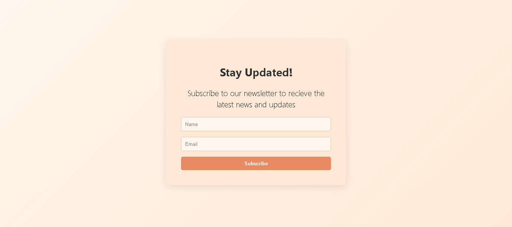

# WebpageForm
A minimal newsletter signup webpage designed with HTML and CSS. Includes gradient background, styled form elements, and interactive button effects.

This project is a modern, responsive webpage built using pure HTML and CSS, designed to showcase a clean and elegant newsletter subscription form. The design focuses on simplicity, readability, and user experience, making it ideal for beginners learning web design fundamentals and layout structure.

✨ Features

🎨 Soft Pastel Theme – Gentle gradient background using warm cream and peach tones for a smooth, welcoming look.

🧾 Interactive Form – Includes input fields for name and email, along with a clearly highlighted subscribe button.

💫 Hover Transitions – Smooth hover animations on buttons to enhance interactivity and give a professional touch.

📱 Responsive Layout – The form stays centered and visually balanced on all screen sizes using flexible CSS properties.

🪄 Clean UI Elements – Rounded corners, subtle shadows, and consistent spacing provide a neat card-like appearance.

🔠 Modern Typography – “Segoe UI” and system fonts used for a clean and readable text experience.

🧱 Tech Stack

HTML5 – For page structure and semantic layout

CSS3 – For styling, gradient backgrounds, transitions, and form design

🚀 How It Works

The webpage welcomes the user with a short introduction and a subscription prompt.

Users can enter their name and email address in the form fields.

Upon clicking the Subscribe button, a smooth hover effect provides visual feedback (can later be linked to a backend or API).

🎯 Learning Focus

This project helps in understanding:

CSS gradients and background design

Responsive form layout using flexbox

Styling input fields and buttons with hover/focus effects

Creating minimal and modern UI designs with soft color palettes

📸 Visual Style

Background: linear-gradient(135deg, #fff6ed, #ffe9d6)

Form Card: #ffe9d6

Button: #e88a63

Hover: #d97a55 with white background

Text: #333 for high readability

Screenshot:

